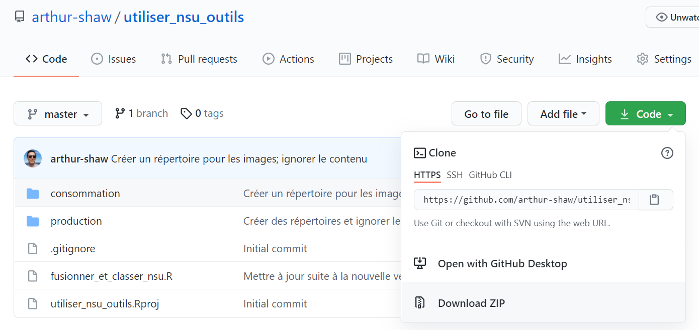
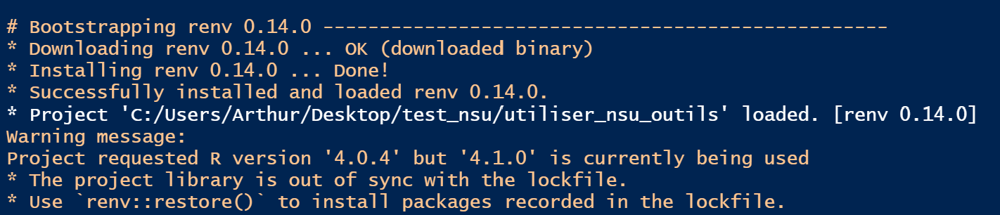

<!-- README.md is generated from README.Rmd. Please edit that file -->

```{r, include = FALSE}
knitr::opts_chunk$set(
  collapse = TRUE,
  comment = "#>",
  eval = FALSE,
  echo = TRUE
)
```

# ehcvm2_rejet

<!-- badges: start -->
<!-- badges: end -->

## Objectifs

The auto-sort program reviews interviews, based on a set of rules, and determines how they should be handled:

- Approved
- Rejected
- Reviewed further
- Flagged for persistent issues

The program then, optionally, executes those decisions by rejecting interviews on the Survey Solutions server and saving locally a compilation of interviews that require manual action (e.g., review to decide whether to reject, discuss with field staff where errors persist, etc.).

## Installation

Avant de lancer ce programme pour la première fois, (re)installer les logiciels suivants:

- R
- RTools
- RStudio

Même si ces logiciels ont été déjà installés (e.g., lors d'une vague antérieure d'EHCVM), il faut réinstaller afin d'avoir une version récente d ces outils pour que le programme marche avec succès.

Veuillez lire ici-bas comment obtenir et installer ces logiciels

### R {#r}

- Suivre ce [lien](https://cran.r-project.org/)
- Cliquer sur le lien approprié pour votre système d'exploitation
- Cliquer sur `base`
- Télécharger et installer (e.g., [ceci](https://cran.r-project.org/bin/windows/base/R-4.1.1-win.exe) pour Windows)

### RTools

Nécessaire pour le système d'exploitation Windows

- Suivre ce [lien](https://cran.r-project.org/)
- Cliquer sur `Windows`
- Cliquer sur `RTools`
- Télécharger et installer (e.g., [ceci](https://cran.r-project.org/bin/windows/Rtools/rtools40v2-x86_64.exe) pour un système 64)

Ce programme permet à R de compiler des scripts C++ utilisés par certains packages (e.g., `{dplyr}`).

### RStudio

- Suivre ce [lien](https://www.rstudio.com/products/rstudio/)
- Sélectionner RStudio Desktop puis Open Source Edition
- Cliquer sur le lien approprié pour votre système d'exploitation
- Télécharger et installer (e.g., [ceci](https://www.rstudio.com/products/rstudio/download/#download) pour Windows)

### Ce programme

- Obtenir une copie du répositoire
  - Naviguer vers [ce répositoire](https://github.com/arthur-shaw/ehcvm2_rejet)
  - Cliquer sur le bouton `Code`
  - Cliquer sur `Download ZIP`
  - Télécharger vers le répertoire voulu sur votre machine

- Décomprimer le fichier zip

## Emploi

### Mettre à jour les tableaux de référence des calories et facteurs

Afin de calculer les calories pour contrôler la consommtaion alimentaire, on a besoin de deux fichiers:

- Calories
- Facteurs

Mais ces fichiers de la première édition ne sont pas en phase avec plusieurs aspects la seconde édition de l'EHCVM. Il y a plusieurs problèmes:

1. La numérotation n'est pas à jour.
1. Les produits éclatés d'anciens produits n'y paraissent pas.
1. Les nouveaux produits n'y figurent pas.

Pour corriger ce problème, il faut:

1. Mettre les fichiers de la première éditions dans le répertoire `/data/00_resource/`
1. Adapter le programmme `actualiser_bases_facteurs_et_calories.R` 
1. Adapter les fichiers Excel connexes
1. Lancer le programme `actualiser_bases_facteurs_et_calories.R`

#### Mettre les fichiers dans `/data/00_resource/`

Pour ce faire:

- Prendre les fichiers de facteurs et de calories de du répertoire du programme de rejet de la seconde vague de l'EHCVM 1--à savoir, du répertoire `/donnees/ressources/` comme [ici](https://github.com/arthur-shaw/ehcvm-tri-automatique/tree/master/donnees/ressources)
- Copier vers le répertoire `/data/00_resource/` de ce projet

#### Adapter le programme

Le programme demande 3 groupes de paramètres:

- Répertoire
- Déscription du fichier des calories
- Déscription du fichier des facteurs de conversion

##### Répertoire

Comme le programme de rejet n'a probablement pas été exécuté, votre séance R ignore l'emplacement du projet et de ses répertoires. Pour corriger cela, mettre le chemin du répertoire des fichiers ressource--c'est à dire, là où vous avez placé les anciens fichiers des facteurs et calories--en suivant les consignes dans les commentaires du programme.

```{r}
# répertoires
# - utiliser / au lieu de \ dans le chemin
# - être certain de mettre / à la fin du chemin
resource_dir <- ""
```

##### Déscription du fichier des calories

Pour décrire le fichier, il faut simplement fournir le nom du fichier et le nom de la colonne contenant l'identifiant des produits.

Le programme suppose que le fichier est le fichier standard utilisé lors de l'EHCVM 1 avec les colonnes suivantes:

```
-------------------------------------------------------------------------------
  obs:           137                          
 vars:             3                          18 Mar 2019 03:18
 size:         1,918                          
-------------------------------------------------------------------------------              
                storage display    value
variable name   type    format     label      variable label
-------------------------------------------------------------------------------
produitID       int     %70.0g     l_produitID
                                              Product ID
kiloCalories    double  %10.0g                Calories per 100g of food
refuseDeflator  float   %9.0g                 Fraction of food quantity that is not inedible refuse
-------------------------------------------------------------------------------
Sorted by: produitID

```

```{r}
# calories
# prendre la base ici: https://github.com/arthur-shaw/ehcvm-tri-automatique/tree/master/donnees/ressources
# sauvegarder dans le répertoire suivant de projet: /data/00_resource/
# indiquer le nom dans entre guillemets ici-bas
fichier_calories            <- "calories.dta"
produit_id_var_calories     <- "produitID"
```

##### Déscription du fichier des facteurs de conversion

Pour décrire le fichier des facteurs, tout comme pour le fichier des calories, fournir le nom du fichier et le nom de la colonne qui contient l'identifiant des produits.

```{r}
# facteurs de conversion des NSU
# prendre la base depuis le programme de rejet de l'EHCVM 2, qui devrait se trouver dans
# le répertoire suivant: /donnees/ressources/
# sauvegarder dans le répertoire suivant de projet: /data/00_resource/
# indiquer le nom dans entre guillemets ici-bas
fichier_facteurs            <- ""
produit_id_var_facteurs     <- ""
```

#### Adapter les fichiers Excel connexes

Pour faciliter l'adaptation, le programme utilise des fichiers Excel pour établir une corréspondance entre les anciens produits et les nouveaux produits:

- calories_produits_eclates.xlsx
- calories_produits_nouveaux.xlsx
- facteurs_produits_eclates.xlsx
- facteurs_produits_nouveaux.xlsx

Dans chaque fichier, l'on retrouve une corréspondance. L'idée est de désigner les anciens produits (source) dont les attributs--par exemple, les calories--sont à copier/utiliser pour les nouveaux produits (cible). Par exemple, dans l'image ici-bas, les calories retenues dans l'EHCVM 1 pour l'ancien produit "Aubergine, Courge/Courgette" sont à retenir dans l'EHCVM 2 pour le nouveau produit "Aubergine".


Les colonnes se terminant en `_source` identifient les anciens produits. Les colonnes se terminant en `_cible` identifient les nouveaux produits. Les colonnes texte donne un déscriptif du produit pour aider la compréhension et fournir une documentation. Les colonnes numériques sont utilisés dans la modification des tableaux de référence.

Bien que les fichiers Excels ont été remplis avec une corréspondance jugée vraisemblable, l'on est libre de modifier les éléments de la corréspondance avant de lancer le programme.

La numérotation est prise en compte une fonction dans le programme.

#### Lancer le programme

Pour lancer le programme, ouvrir le programme dans RStudio et cliquer sur le bouton `Source`. Lors de son exécution, le programme créera deux sorties qui seront utilisées par le programme de rejet:

- calories_ehcvm2.dta
- facteurs_ehcvm2.dta

Ces fichiers auront la même forme et un contenu modifié. En particulier:

- Numérotation conforme à celle de l'EHCVM 2
- Ajout de produits éclatés
- Ajout de nouveaux produits

### Fournir les paramètres du projet

Ceci comprend les étapes suivantes :

1. Indiquer la localisation du projet
1. Décrire les fichiers de référence
1. Fournir les détails du serveur Survey Solutions
1. Identifier le questionnaire dans Headquarters
1. Fournir le "questionnaire variable" du questionnire dans Designer
1. Spécifier comment le programme doit se comporter

#### Indiquer la localisation du projet

For the program to run, it needs to know where it is located in your file system. To get the program oriented, provide the file path to the root of the project (i.e., directory in which `ehcvm2_rejet.Rproj` is located). This path should be specified as the value of `proj_dir` (i.e., in the quotes)

When doing so, follow the rules repeated in the code chunk below:

- Use `/` instead of `\` in file path. In R, `\` means something special.
- Be sure to put / at the end of the path. This will help with constructing other file paths relative to the root.

```{r}
# =============================================================================
# Localisation de la racine du projet
# =============================================================================

# suivre ces consignes dans la spécification du répertoire racine
# - utiliser / au lieu de \ dans le chemin
# - être certain de mettre / à la fin du che
proj_dir    <- ""
```

#### Décrire les fichiers de référence

Comme la forme des fichiers de référence peut varier d'un pays à l'autre, il faut indiquer au programme le nom des fichiers et le nom de certaines colonnes clé.

Pour les calories, dans `nom_fichier_calories`, le nom du fichier.

Pour les facteurs de conversion:

- `nom_fichier_facteurs`. Nom du fichier.
- `facteurs_niv`. Niveau d'observation des facteurs: "national" ou "strate".
- `facteurs_prod_id`. Nom de la colonne qui identifie les produits.
- `facteurs_region`. Nom de la colonne région, entre guillemets (e.g., "s00q01"). Si le fichier fournit les facteurs au niveau national, mettre `NULL`.
- `facteurs_milieu`. Nom de la colonne strate, entre guillemets. Si le fichier est au niveau national, mettre `NULL`.
- `facteurs_unite`. Nom de la colonne avec les codes d'unité.
- `facteurs_taille`. Nom de la colonne avec les codes de taille.
- `facteurs_poids`. Nom de la colonne avec le facteur de conversion à appliquer (e.g., "poids_median").

```{r}
# =============================================================================
# Décrire les fichiers de référence
# =============================================================================

# calories
nom_fichier_calories <- "calories_ehcvm2.dta" 

# facteurs de conversion
nom_fichier_facteurs <- "facteurs_ehcvm2.dta"
facteurs_niv    <- "national" # "national" ou "strate"
facteurs_prod_id <- ""
facteurs_region <- NULL # si niveau national, mettre NULL
facteurs_milieu <- NULL # si niveau national, mettre NULL
facteurs_unite  <- ""
facteurs_taille <- ""
facteurs_poids  <- ""
```

#### Providing details for connecting to the Survey Solutions

In order for the program to interact with your server in any way--whether that is downloading data or rejecting interviews--it needs connection details.

These details are as follows:

- `server`. Full URL or the server.
- `workspace`. Workspace name--not the display name.
- `user`.  User name for an admin or API user authorized for the workspace above.
- `password`. Password for that user.

```{r}
# =============================================================================
# Fournir les détails du serveur Survey Solutions
# =============================================================================

# fournir
server      <- ""
workspace   <- ""
user        <- ""
password    <- ""

susoapi::set_credentials(
    server = server,
    user = user,
    password = password
)
```

For more information on why this information is needed and how it is used, please read about Survey Solutions authentication [here](https://arthur-shaw.github.io/susoapi/articles/authentication.html)

#### Identifier le questionnaire dans Headquarters

```{r}
# =============================================================================
# Questionnaire sur Headquarters dont les données sont à passer en revue
# =============================================================================

# fournir un texte qui identifie le questionanire. il peut s'agir du:
# - nom complet
# - sous-texte
# - expression régulière
qnr_expr <- ""
```

#### Fournir le "questionnaire variable" du questionnire dans Designer

```{r}
# =============================================================================
# Questionnaire sur Designer
# =============================================================================

# fournir la "variable du questionnaire".
# normalement, ça doit être "menage", comme la valeur de défaut ici-bas
# pour certains, ça a été modifié, parfois pour des raisons d'organisation interne
# pour vérifier ou modifier, voici comment faire:
# - se connecter à Designer
# - ouvrir le questionnaire ménage
# - cliquer sur paramètres
# - copier ce qui figure dans le champs "questionnaire variable" et le coller ici-bas
# pour des informations complémentaires, voir ici: https://docs.mysurvey.solutions/questionnaire-designer/components/questionnaire-variable/
main_file_name <- "menage"
main_file_dta <- paste0(main_file_name, ".dta")
```

#### Specifying how the program should behave

The program needs to know how to act in two dimensions:

1. Which Survey Solutions interview statuses to consider for review
2. Whether the program should reject any reviews recommended for rejection

The `statuses_to_reject` variable captures the comma-separated list of statuses subject to review. See the notes below on which interview statuses are currently allowed.

The `should_reject`variable captures whether or not interviews recommended for rejection should be automatically rejected. See the code chunk below on how the values are interpretted.

```{r}
# =============================================================================
# Comportement du rejet: quels statuts et quels problèmes rejeter
# =============================================================================

# Fournir une liste délimitée par virgule des statuts d'entretien à passer en revue
# Voir les valeurs ici: https://docs.mysurvey.solutions/headquarters/export/system-generated-export-file-anatomy/#coding_status
# Statuts admis par ce script: 
# - Completed: 100
# - ApprovedBySupervisor: 120
# - ApprovedByHeadquarters: 130
statuses_to_reject <- c(100, 120)

# Fournir une liste délimitée par virgule des types de problèmes à rejeter
# {susoreview} utilise les codes suivants:
# - 1 = Rejeter
# - 2 = Commenter une variable
# - 3 = Erreur de validation de Survey Solutions
# - 4 = Passer en revue
issues_to_reject <- c(1)

# Rejeter les entretiens automatiquement
# - Si TRUE, le programme demande au serveur de rejeter ces entretiens.
# - Si FALSE, le programme ne rejette pas.
# - Dans les deux cas, les entretiens à rejeter, ainsi que les motifs de rejet,
#   sont sauvegardés dans `/output/`
should_reject <- FALSE
```

### Lancer {#lancer}

Une fois les préparatifs ci-haut terminés, il est temps de lancer le programme. Pour ce faire:

- Ouvrir RStudio
- Ouvrir le fichier `ehcvm2_rejet.Rproj` qui aura l'effet de fournir les ressources du projet
- Ouvrir le fichier `_run.R` que vous avez modifié plus haut
- Lancer le programme
- Accepter de mettre à jour les packages

Après avoir ouvert le fichier  `ehcvm2_rejet.Rproj`, RStudio affichera un message comme suit, indiquant que:



- Le package `{renv}`, qui est reponsable contrôles la version des packages chez tous les utilisateurs, a été installé
- La version de R installée sur votre machine soit est soit n'est pas en en phase avec la version indiqué dans le fichier de contrôle de version.

Si votre version de R n'est pas en accord avec la version de R attendu, veuillez installer la version convenue. S'il s'agit d'une plus ancienne version de R, il faut aller la chercher sur CRAN:

- Suivre les instructions [ici](#r)
- Suivre le lien montré ici-bas

- Chercher, obtenir, et installer la version convenue (e.g., 4.0.4)


Lors du premier lancement du, RStudio demandera si vous voulez adopter les packages demandé pour ce projet, comme indiqué ici-bas.


Taper `y` dans la console de RStudio. Ceci créera un répertoire pour ce projet dont les versions des packages s'accorderont avec ce qui est jugé nécessaire pour le bon déroulement du programme. Ceci n'aura pas d'effet sur les versions des packages installées sur votre machine. Pour en savoir plus, regarder la documentation de `{renv}` [ici](https://rstudio.github.io/renv/articles/renv.html).

### Dépanner {#depanner}

#### Problèmes connus

Si vous lancez le programme comme indiqué ci-haut et rencontrez une erreur qui ressemble celle ici-bas, R rencontre un problème à télécharger et installer les packages requis.


Pour surmonter ce problème, veuillez suivre ces étapes:

-	Ouvrir le fichier Rproj
-	Avant de lancer le programme, exécuter la commande:  `Sys.setenv(RENV_DOWNLOAD_METHOD = "wininet")`
-	Lancer le programmer

Si le lancement du programme échoue à nouveau, il est fort à parier que R--ou plutôt le package `{renv}`--rencontre problèmes à télécharger et installer le package `{nsuoutils}` depuis GitHub.

Pour aider R à installer `{nsuoutils}`, veuillez suivre ces étapes:

- Ouvrir une nouvelle instance de RStudio. C'est à dire:
  - Fermer toute fenêtre de RStudio déjà ouvert
  - Ouvrir RStudio à nouveau
  - S’assurer que le projet `utiliser_nsu_outils` est bien fermé. Au besoin, le fermer comme montré ici-bas:


- Installer les packages manquants en exécutant les commandes suivantes:

```{r}
# d'abord installer {nsuoutils}
install.packages("devtools")
devtools::install_github("arthur-shaw/nsuoutils")
 
# ensuite, installer {rmarkdown} 
# au cas où il n'est pas installé lors de l'installation de {nsuoutils}
install.packages("rmarkdown")
```

- Relancer le programme le programme comme indiqué [ici](#lancer)

#### Problèmes inconnus

Si vous disposer d'un compte GitHub, créer un issue [ici](https://github.com/arthur-shaw/nsuoutils), chez le package responsable des manipulations faites dans ce programme.

Si vous n'avez pas de compte, envoyer un message.

Dans les deux cas, tâcher de fournir un descriptif détaillé et, si possible, un exemple reproduisible. Dans le descriptif détaillé, envoyer:

- Description des étapes suivies
- Capture d'écran du message d'erreur
- Informations concernant votre séance de travail, lancer des commandes après l'échec du programme et copier-coller le résultat:

```{r}
# ceci fournit des informations détaillées sur les actions prises par {renv}
# dans l'installation de packages requis, et met en évidence
# les problèmes rencontrés et les paramètres utilisé 
renv::diagnostics()

# ces commandes fournissent des informations sur:
# - la méthode employée pour télécharger les packages
# - le répositore où les packages sont recherchés
getOption("download.file.method")
capabilities("libcurl")
getOption("repos")

# cette commande fournit des informations sur votre environnement d'exécution
sessionInfo()
```

Dans l'exemple reproduisible, partager les données d'entrée par un moyen sécurisé (i.e., pas GitHub, rien de publique où d'autres peuvent voir les données).