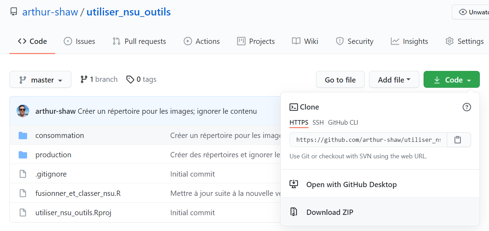
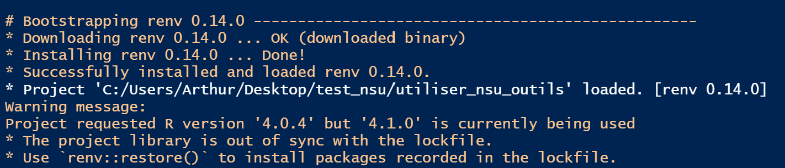
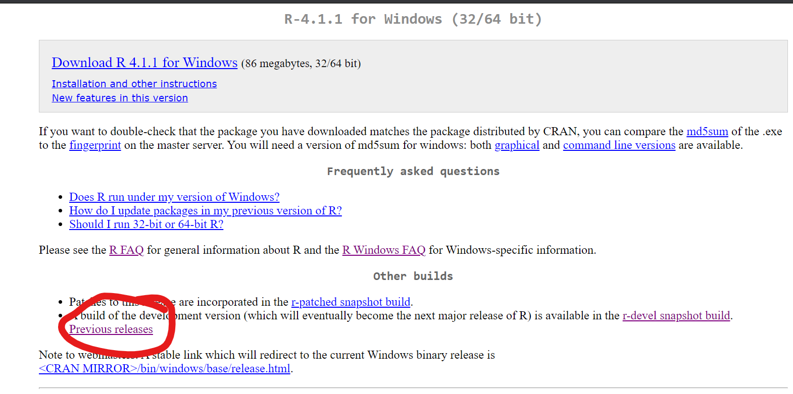
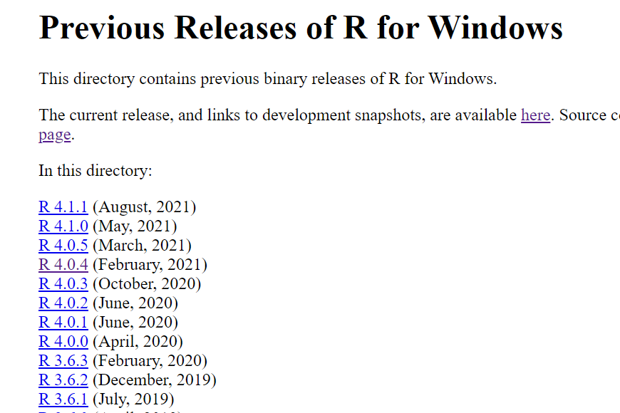
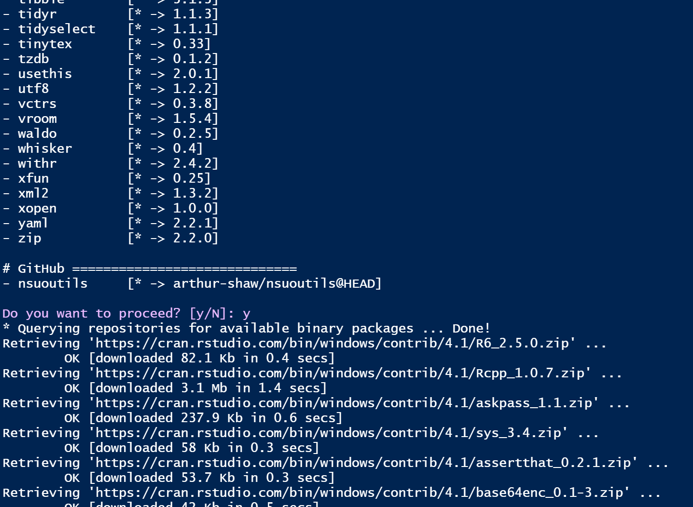
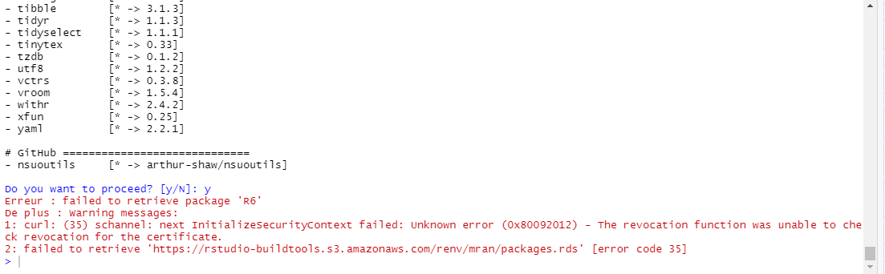
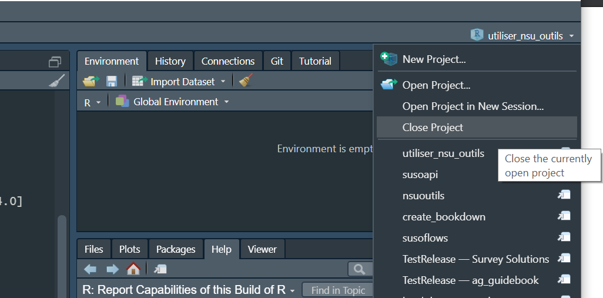

<!-- README.md is generated from README.Rmd. Please edit that file -->

# ehcvm2\_rejet

<!-- badges: start -->
<!-- badges: end -->

## Objectifs

The auto-sort program reviews interviews, based on a set of rules, and
determines how they should be handled:

-   Approved
-   Rejected
-   Reviewed further
-   Flagged for persistent issues

The program then, optionally, executes those decisions by rejecting
interviews on the Survey Solutions server and saving locally a
compilation of interviews that require manual action (e.g., review to
decide whether to reject, discuss with field staff where errors persist,
etc.).

## Installation

Avant de lancer ce programme pour la première fois, (re)installer les
logiciels suivants:

-   R
-   RTools
-   RStudio

Même si ces logiciels ont été déjà installés (e.g., lors d’une vague
antérieure d’EHCVM), il faut réinstaller afin d’avoir une version
récente d ces outils pour que le programme marche avec succès.

Veuillez lire ici-bas comment obtenir et installer ces logiciels

### R

-   Suivre ce [lien](https://cran.r-project.org/)
-   Cliquer sur le lien approprié pour votre système d’exploitation
-   Cliquer sur `base`
-   Télécharger et installer (e.g.,
    [ceci](https://cran.r-project.org/bin/windows/base/R-4.1.1-win.exe)
    pour Windows)

### RTools

Nécessaire pour le système d’exploitation Windows

-   Suivre ce [lien](https://cran.r-project.org/)
-   Cliquer sur `Windows`
-   Cliquer sur `RTools`
-   Télécharger et installer (e.g.,
    [ceci](https://cran.r-project.org/bin/windows/Rtools/rtools40v2-x86_64.exe)
    pour un système 64)

Ce programme permet à R de compiler des scripts C++ utilisés par
certains packages (e.g., `{dplyr}`).

### RStudio

-   Suivre ce [lien](https://www.rstudio.com/products/rstudio/)
-   Sélectionner RStudio Desktop puis Open Source Edition
-   Cliquer sur le lien approprié pour votre système d’exploitation
-   Télécharger et installer (e.g.,
    [ceci](https://www.rstudio.com/products/rstudio/download/#download)
    pour Windows)

### Ce programme

-   Obtenir une copie du répositoire
    -   Naviguer vers [ce
        répositoire](https://github.com/arthur-shaw/ehcvm2_rejet)
    -   Cliquer sur le bouton `Code`
    -   Cliquer sur `Download ZIP`
    -   Télécharger vers le répertoire voulu sur votre machine
        
-   Décomprimer le fichier zip

## Emploi

### Provide program paramters

This involves:

1.  Providing the file path to the program
2.  Specifying how the program should behave
3.  Providing details for connecting to the Survey Solutions

#### Providing the file path to the program

For the program to run, it needs to know where it is located in your
file system. To get the program oriented, provide the file path to the
root of the project (i.e., directory in which `auto-sort.Rproj` is
located). This path should be specified as the value of `proj_dir`
(i.e., in the quotes)

When doing so, follow the rules repeated in the code chunk below:

-   Use `/` instead of `\` in file path. In R, `\` means something
    special.
-   Be sure to put / at the end of the path. This will help with
    constructing other file paths relative to the root.

``` r
# =============================================================================
# Locate project root
# =============================================================================

# follow these guidelines in specifying the root folder
# - use / instead of \ in file path
# - be sure to put / at the end of the path
proj_dir    <- ""
```

#### Specifying how the program should behave

The program needs to know how to act in two dimensions:

1.  Which Survey Solutions interview statuses to consider for review
2.  Whether the program should reject any reviews recommended for
    rejection

The `statuses_to_reject` variable captures the comma-separated list of
statuses subject to review. See the notes below on which interview
statuses are currently allowed.

The `should_reject`variable captures whether or not interviews
recommended for rejection should be automatically rejected. See the code
chunk below on how the values are interpretted.

``` r
# =============================================================================
# Program behavior parameters
# =============================================================================

# Provide a comma-separated list of interview statuses to review.
# See status values here: https://docs.mysurvey.solutions/headquarters/export/system-generated-export-file-anatomy/#coding_status
# Statuses supported by this script include: 
# - Completed: 100
# - ApprovedBySupervisor: 120
# - ApprovedByHeadquarters: 130
statuses_to_reject <- c(100, 120)

# Whether to reject interviews recommended for rejection
# - If TRUE, the program will instruct the server to reject these interviews.
# - If FALSE, the program will not.
# - In either case, the interviews recommended for rejection, and the reasons why, are saved in `/output/`
should_reject <- TRUE
```

#### Providing details for connecting to the Survey Solutions

In order for the program to interact with your server in any way–whether
that is downloading data or rejecting interviews–it needs connection
details.

These details are as follows:

-   `server`. Full URL or the server.
-   `workspace`. Workspace name–not the display name.
-   `user`. User name for an admin or API user authorized for the
    workspace above.
-   `password`. Password for that user.

``` r
# =============================================================================
# Provide Survey Solutions details
# =============================================================================

server      <- ""
workspace   <- ""
user        <- ""
password    <- ""

susoapi::set_credentials(
    server = server,
    user = user,
    password = password
)
```

For more information on why this information is needed and how it is
used, please read about Survey Solutions authentication
[here](https://arthur-shaw.github.io/susoapi/articles/authentication.html)

### Lancer

Une fois les préparatifs ci-haut terminés, il est temps de lancer le
programme. Pour ce faire:

-   Ouvrir RStudio
-   Ouvrir le fichier `ehcvm2_rejet.Rproj` qui aura l’effet de fournir
    les ressources du projet
-   Ouvrir le fichier `_run.R` que vous avez modifié plus haut
-   Lancer le programme
-   Accepter de mettre à jour les packages

Après avoir ouvert le fichier `ehcvm2_rejet.Rproj`, RStudio affichera un
message comme suit, indiquant que:



-   Le package `{renv}`, qui est reponsable contrôles la version des
    packages chez tous les utilisateurs, a été installé
-   La version de R installée sur votre machine soit est soit n’est pas
    en en phase avec la version indiqué dans le fichier de contrôle de
    version.

Si votre version de R n’est pas en accord avec la version de R attendu,
veuillez installer la version convenue. S’il s’agit d’une plus ancienne
version de R, il faut aller la chercher sur CRAN:

-   Suivre les instructions [ici](#r)
-   Suivre le lien montré ici-bas 
-   Chercher, obtenir, et installer la version convenue (e.g., 4.0.4)
    

Lors du premier lancement du, RStudio demandera si vous voulez adopter
les packages demandé pour ce projet, comme indiqué ici-bas.



Taper `y` dans la console de RStudio. Ceci créera un répertoire pour ce
projet dont les versions des packages s’accorderont avec ce qui est jugé
nécessaire pour le bon déroulement du programme. Ceci n’aura pas d’effet
sur les versions des packages installées sur votre machine. Pour en
savoir plus, regarder la documentation de `{renv}`
[ici](https://rstudio.github.io/renv/articles/renv.html).

### Dépanner

#### Problèmes connus

Si vous lancez le programme comme indiqué ci-haut et rencontrez une
erreur qui ressemble celle ici-bas, R rencontre un problème à
télécharger et installer les packages requis.



Pour surmonter ce problème, veuillez suivre ces étapes:

-   Ouvrir le fichier Rproj
-   Avant de lancer le programme, exécuter la commande:
    `Sys.setenv(RENV_DOWNLOAD_METHOD = "wininet")`
-   Lancer le programmer

Si le lancement du programme échoue à nouveau, il est fort à parier que
R–ou plutôt le package `{renv}`–rencontre problèmes à télécharger et
installer le package `{nsuoutils}` depuis GitHub.

Pour aider R à installer `{nsuoutils}`, veuillez suivre ces étapes:

-   Ouvrir une nouvelle instance de RStudio. C’est à dire:
    -   Fermer toute fenêtre de RStudio déjà ouvert
    -   Ouvrir RStudio à nouveau
    -   S’assurer que le projet `utiliser_nsu_outils` est bien fermé. Au
        besoin, le fermer comme montré ici-bas:



-   Installer les packages manquants en exécutant les commandes
    suivantes:

``` r
# d'abord installer {nsuoutils}
install.packages("devtools")
devtools::install_github("arthur-shaw/nsuoutils")
 
# ensuite, installer {rmarkdown} 
# au cas où il n'est pas installé lors de l'installation de {nsuoutils}
install.packages("rmarkdown")
```

-   Relancer le programme le programme comme indiqué [ici](#lancer)

#### Problèmes inconnus

Si vous disposer d’un compte GitHub, créer un issue
[ici](https://github.com/arthur-shaw/nsuoutils), chez le package
responsable des manipulations faites dans ce programme.

Si vous n’avez pas de compte, envoyer un message.

Dans les deux cas, tâcher de fournir un descriptif détaillé et, si
possible, un exemple reproduisible. Dans le descriptif détaillé,
envoyer:

-   Description des étapes suivies
-   Capture d’écran du message d’erreur
-   Informations concernant votre séance de travail, lancer des
    commandes après l’échec du programme et copier-coller le résultat:

``` r
# ceci fournit des informations détaillées sur les actions prises par {renv}
# dans l'installation de packages requis, et met en évidence
# les problèmes rencontrés et les paramètres utilisé 
renv::diagnostics()

# ces commandes fournissent des informations sur:
# - la méthode employée pour télécharger les packages
# - le répositore où les packages sont recherchés
getOption("download.file.method")
capabilities("libcurl")
getOption("repos")

# cette commande fournit des informations sur votre environnement d'exécution
sessionInfo()
```

Dans l’exemple reproduisible, partager les données d’entrée par un moyen
sécurisé (i.e., pas GitHub, rien de publique où d’autres peuvent voir
les données).
